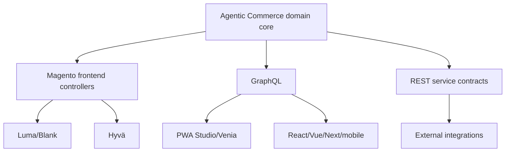
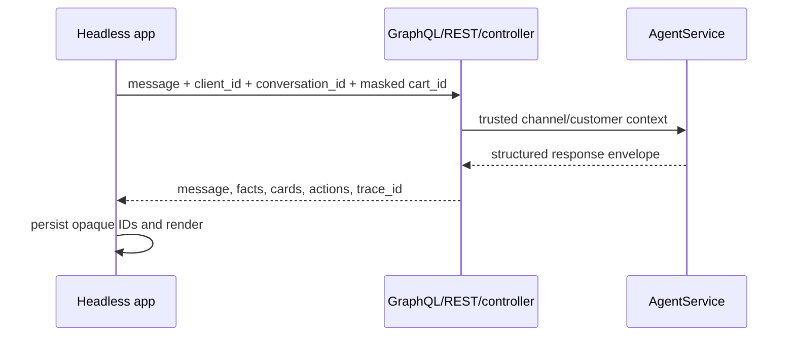
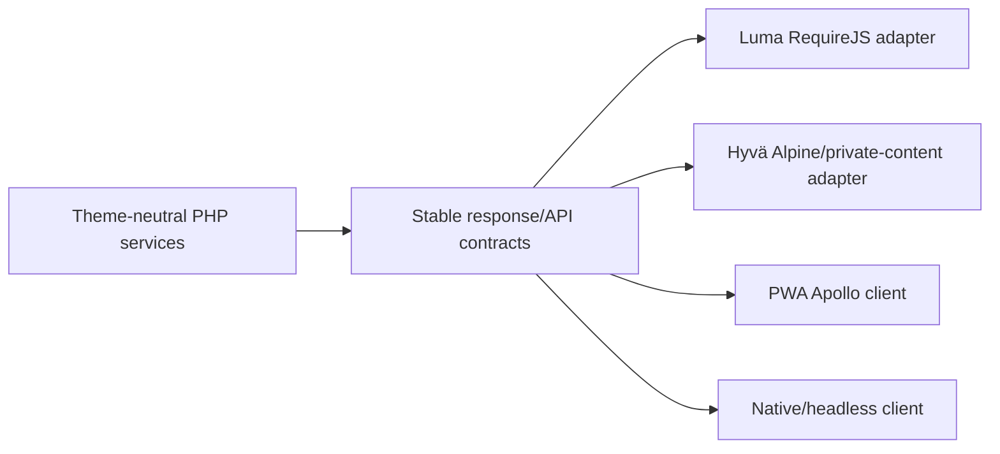

# API and channel architecture

> Version 5.0.0 · Reviewed 2026-08-26

## One core, multiple clients

Provider credentials and Magento identity stay server-side. Clients render structured results; they do not implement commerce authority.

## API discovery

- `GET /V1/agentic-commerce/capabilities`
- `GET /V1/agentic-commerce/store-profile`
- GraphQL `agenticCommerceCapabilities`
- GraphQL `agenticCommerceStoreProfile`

Clients should discover capabilities instead of assuming every feature is enabled.

## Chat request

Never send `customer_id`, `customer_group_id`, numeric quote ID, payment secrets or client-authored recent-product authority.

## Channel responsibility matrix

| Responsibility | Server core | Client |
|---|---:|---:|
| Trusted identity/customer group | Yes | No |
| Tool planning/policy | Yes | No |
| Price/stock/cart/order facts | Yes | Render only |
| Conversation ownership | Yes | Persist opaque ID |
| Product cards/actions | Structure | Presentation |
| Accessibility/focus/live regions | Semantic payload support | Yes |
| Provider API key | Yes | Never |
| Theme styling | No | Yes |

## Compatibility strategy

Theme adapters may refresh Magento customer data/private content after mutations, but they must not recreate tool authorization.

### RizAI model-discovery fields

`agenticCommerceCapabilities` exposes additive model metadata so headless clients and operations tooling can distinguish model availability from provider configuration:

- `rizai_model_id` — bundled artifact identifier, currently `rizai-commerce-intent-v1`;
- `rizai_model_type` — currently `feed_forward_neural_network`;
- `rizai_neural_available` — whether the bundled model artifact loaded successfully;
- `rizai_neural_enabled` — store-scoped Admin feature flag.

These fields describe the local neural classifier. They do not imply that a generative LLM checkpoint is bundled. A separately served generative RizAI checkpoint is selected through the `rizai_local_llm` provider.

## Versioning

- Module version: `5.0.0`
- Capability API version: `2026-08-v5.0`
- New response members should be additive and nullable/empty when unused.
- Extension payloads use bounded namespaced `extensions` entries.
- The internal `deterministic` provider code remains stable; its user-facing name is RizAI.

See [HEADLESS.md](HEADLESS.md) for GraphQL examples.
