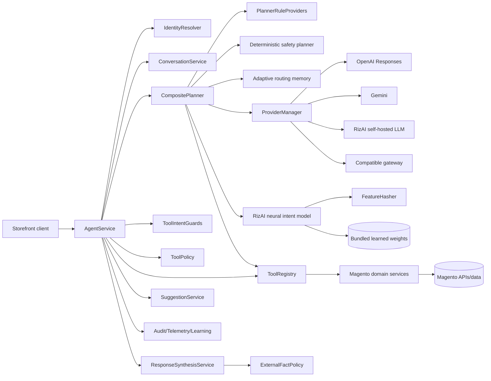
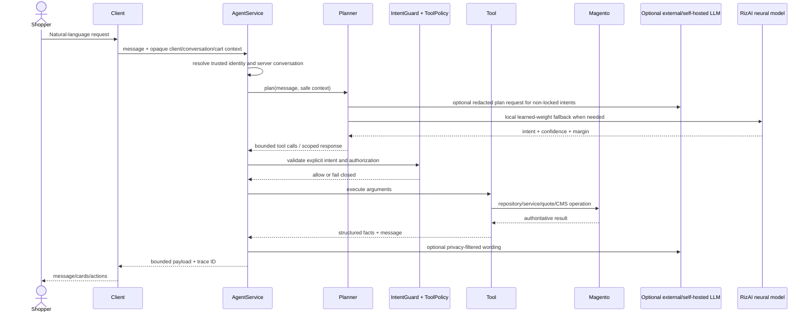
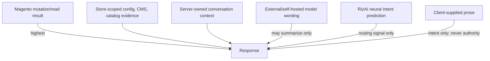
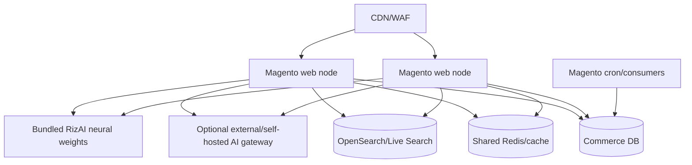
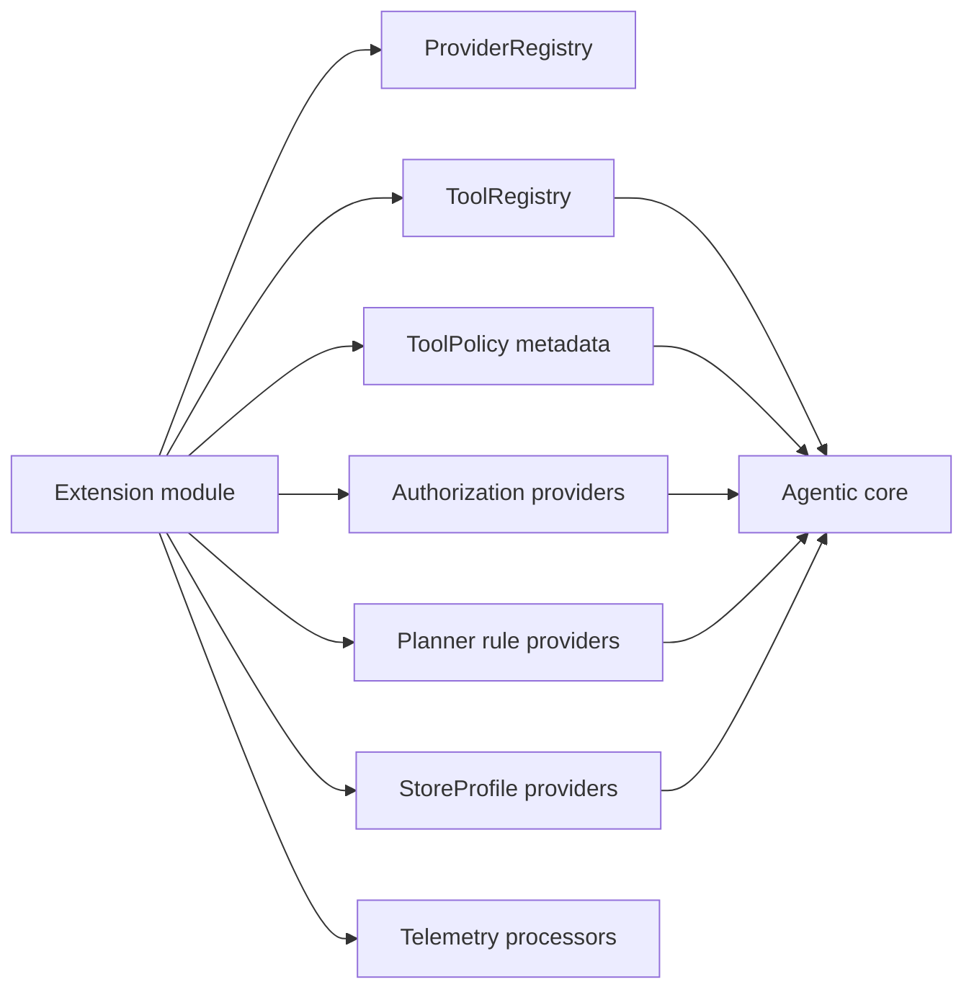

# Architecture

> Version 5.0.0 · Reviewed 2026-08-26

## Component architecture

## Request sequence

## Authority hierarchy

## Deployment topology

Conversation, confirmation, idempotency, learning and audit authority is not process-local. Provider health/rate state should use shared Magento cache.

## Extension architecture

