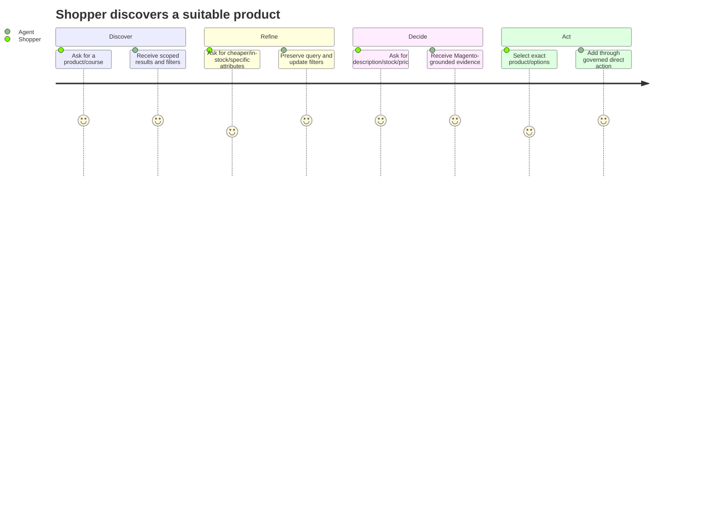
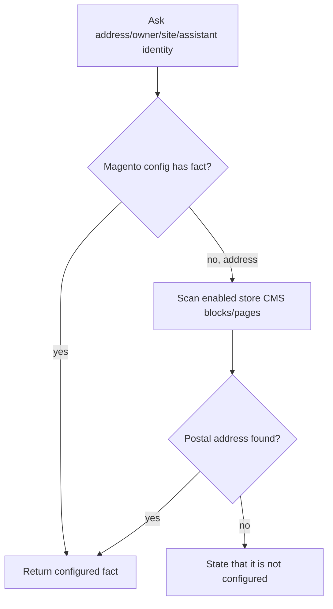
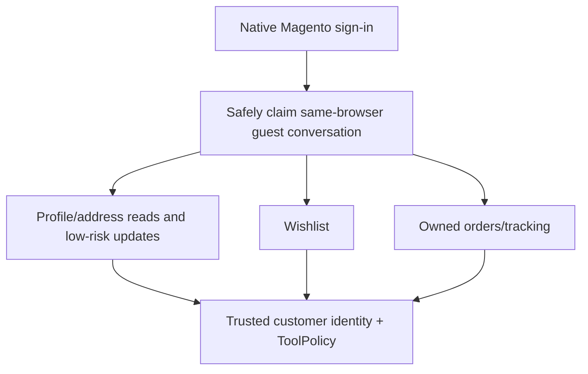
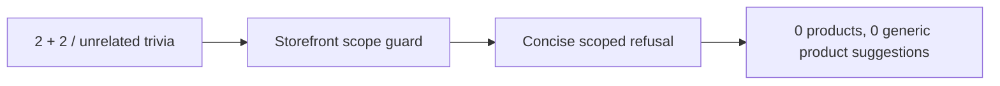

# Customer flows

> Version 5.0.0 · Reviewed 2026-08-26

## 1. Product discovery and refinement



## 2. CMS/storefront question

```mermaid
sequenceDiagram
    actor Shopper
    participant Agent
    participant RizAI
    participant CMS as KnowledgeService
    participant AI as Optional OpenAI/Gemini
    Shopper->>Agent: "What's blended learning?"
    Agent->>RizAI: classify
    RizAI-->>Agent: answer_store_question
    Agent->>CMS: current-store pages + blocks
    CMS-->>Agent: ranked bounded evidence
    Agent->>AI: optional privacy-safe wording
    Agent-->>Shopper: grounded definition; no product dump
```

## 3. Address/store identity



## 4. Cart and checkout

```mermaid
flowchart LR
    P[Select exact product/options] --> ADD[Add to cart]
    ADD --> CART[Review/update/remove/coupon]
    CART --> STATE[Checkout state]
    STATE --> EMAIL[Guest email if required]
    EMAIL --> ADDR[Shipping/billing address]
    ADDR --> SHIP[Shipping method]
    SHIP --> PAY[Payment method metadata]
    PAY --> PREP[Prepare order]
    PREP --> CONF[Explicit confirmation token]
    CONF --> ORDER[Magento places order]
```



Payment secrets remain in native/provider UI, not chat.

## 5. Signed-in customer



## 6. Out-of-scope request



## Expected customer experience

- A new question never displays stale product cards from a prior turn.
- Informational CMS/store-profile answers suppress unrelated latest/cheapest suggestions.
- Existing conversation history remains immutable; corrected behavior applies to new turns.
- A customer sees only their owned cart, wishlist, addresses and orders.
