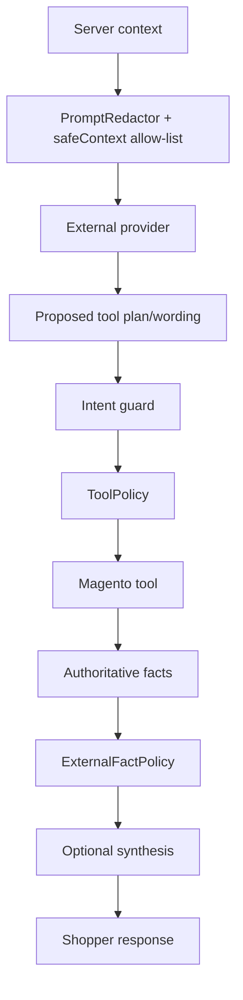
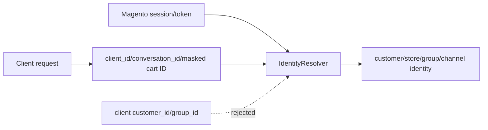
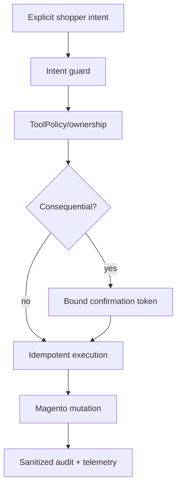

# Data and security flows

> Version 5.0.0 · Reviewed 2026-08-26

## Data classification

| Class | Examples | External AI |
|---|---|---|
| Public storefront | Product/CMS/store profile, public price | Configurable, bounded/redacted |
| Customer commerce | Cart, wishlist, checkout state | Only when allowed; PII removed |
| Customer PII | Name, email, phone, address | Excluded from planner; direct forms/services |
| Authentication | Passwords/tokens | Never |
| Payment secrets | PAN/CVV/provider payload | Never |
| Operational secrets | AI keys, internal IDs | Never |

## External provider flow

## Identity trust boundary

## Mutation boundary

## Prompt-injection handling

Catalog names, product descriptions, reviews and CMS content are data. They can provide evidence but cannot redefine tool policy, request secrets, authorize actions or change system scope.

## Retention

Conversation messages, audit, confirmation, learning/feedback and idempotency records have separate configurable cleanup schedules. Production requires healthy Magento cron and shared cache.
