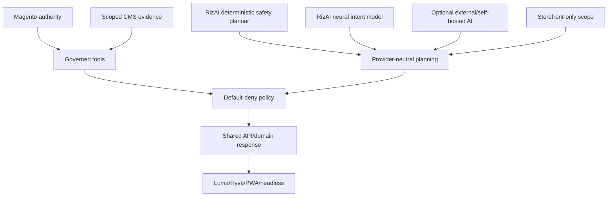

# Design decisions

> Version 5.0.0 · Reviewed 2026-08-26

## Decision summary

| ID | Decision | Reason |
|---|---|---|
| ADR-001 | Magento remains authoritative | Preserve scope, plugins, pricing, inventory, quote and ownership rules |
| ADR-002 | RizAI is always available | Bundled local neural model + deterministic fallback require no external key |
| ADR-003 | Generative AI plans/words but does not authorize | Models are probabilistic and cannot own commerce security |
| ADR-004 | Tools are default-deny metadata | Unknown capabilities fail closed |
| ADR-005 | Exact UI actions bypass NLP | Structured intent is safer than reinterpreting a button click |
| ADR-006 | CMS content is scoped evidence and untrusted prompt data | Merchant-managed knowledge without prompt-policy authority |
| ADR-007 | Out-of-scope questions do not degrade to search | Prevent catalog dumps and misleading cards |
| ADR-008 | Consequential actions require server confirmation | Protect checkout/destructive workflows |
| ADR-009 | PII/payment secrets stay outside provider planning | Privacy and payment compliance boundary |
| ADR-010 | APIs and theme adapters share domain services | Luma/Hyvä/PWA/headless behavior remains consistent |
| ADR-011 | Additive response envelope and stable provider codes | Backward-compatible integrations/configuration |
| ADR-012 | DI registries instead of core forks | Enterprise/vertical extensibility |
| ADR-013 | Neural predictions are read-only routing proposals | Learned weights cannot grant mutations or bypass ToolPolicy |
| ADR-014 | Neural weight updates are offline/versioned | Prevent live poisoning and preserve reproducibility/rollback |

## Decision interaction

## Consequences

- Some generic questions are deliberately declined.
- New business capabilities require a service/tool and policy metadata, not only prompt text.
- CMS quality and store assignment directly affect knowledge quality.
- External-provider or neural-model improvements cannot bypass deterministic locks or Magento facts.
- Neural model releases require offline review/evaluation; runtime adaptive memory does not update weights.
- More interfaces/registries exist, but upgrades and enterprise integration avoid repeated core edits.

## When to add a new ADR

Add a dated decision when changing an authority boundary, public API, identity model, confirmation requirement, data sent externally, persistence behavior or supported channel contract.
