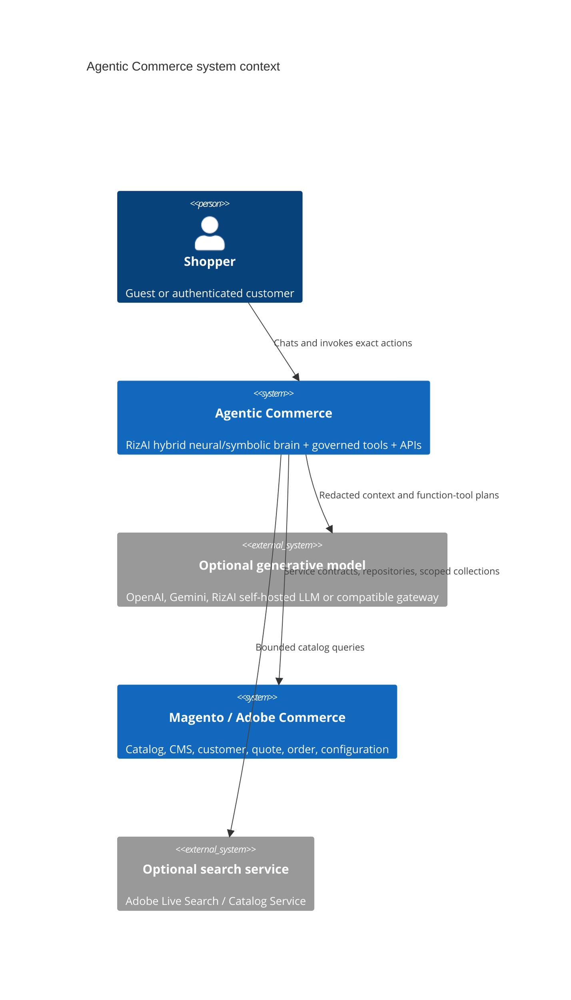
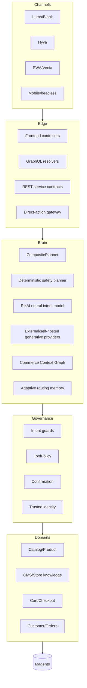

# High-level design

> Version 5.0.0 · Reviewed 2026-08-26

## Objective

Provide one governed conversational-commerce core across Luma, Hyvä, PWA Studio, mobile and headless storefronts. It must discover products, explain Magento-managed content and perform supported commerce actions without allowing an AI provider to become the source of truth.

## System context

## Core capabilities

- RizAI hybrid neuro-symbolic planning: learned neural intent model + deterministic safety kernel + safe external-provider fallback.
- Store-scoped catalog, price, stock, CMS, store-profile and navigation knowledge.
- Cart, coupon, wishlist, checkout, account, order, review, newsletter and alert tools.
- Persistent conversations, confirmation gates, idempotency, audit and telemetry.
- REST, GraphQL and theme-neutral domain services.
- DI registries for providers, tools, policies, planners, suggestions and extension data.

## Logical layers

## Quality attributes

| Attribute | Design response |
|---|---|
| Security | Default-deny tools, trusted identity, redaction, confirmation and endpoint policy |
| Accuracy | Magento-authoritative facts, evidence states, no invented commerce facts |
| Availability | Local RizAI neural/deterministic fallback, provider circuit breaker, native-search fallback |
| Scalability | Shared cache, database-backed state, bounded collections and payloads |
| Extensibility | Magento DI registries and public interfaces |
| Portability | Theme-independent PHP core with REST/GraphQL surfaces |
| Accessibility | Semantic storefront controls and live conversational status |
| Auditability | Trace IDs, sanitized tool audit and telemetry events |

## Out of scope

- General-purpose assistant/trivia service.
- Arbitrary web browsing or external facts overriding Magento.
- Direct SQL/model access to Magento business tables.
- Password or payment-secret collection.
- Unconfirmed consequential actions.
