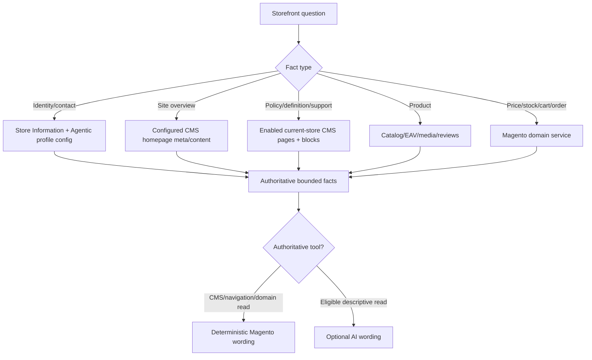
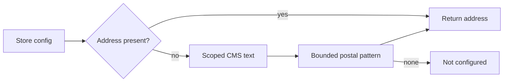

# Storefront knowledge and grounding

> Version 5.0.0 · Reviewed 2026-08-26

## Purpose

Answer questions from content the merchant actually manages in Magento. CMS and navigation
results keep Magento-authored wording; an external model cannot contradict a found page/link.

## Source priority

## CMS scope rules

- Only active pages/blocks assigned to the current store or All Store Views are considered.
- The homepage identifier comes from `web/default/cms_home_page`; it is not hard-coded.
- Overview questions prefer the homepage meta description when configured.
- All active scoped page/block records are indexed; returned results remain bounded and are
  ranked across entity titles, identifiers, visible headings, visible link labels and readable text.
- `{{store direct_url=...}}` and `{{store url=...}}` links are resolved without executing the CMS
  template engine. Widgets, PHP blocks and arbitrary directives are never executed during chat
  intent classification.
- Hidden/script/style/template content is removed, entities are decoded and snippets are bounded.
- Repeated page/block destinations and store-code footer variants are de-duplicated and ranked in
  favor of the active store view.
- The sanitized index uses Magento shared cache with `cms_p`, `cms_b`, `CONFIG`, and `store` tags,
  plus an in-request memory cache. CMS/store saves invalidate the shared entry automatically.
- CMS text is untrusted data for prompt-injection purposes.
- Disabled or other-store-only content must not become evidence.

## Public fact extraction

`StoreInformationService` first reads standard store configuration. If a public address is not configured there, `KnowledgeService::publicFact('address')` searches active store CMS content for a postal-address shape. This supports footer/contact blocks without compiling a merchant address into PHP.

## Intent examples

| Request | Route | Evidence |
|---|---|---|
| `What's the address?` | `get_store_information` | Config, then CMS public fact |
| `What is this website about?` | `answer_store_question` | Configured homepage meta/content |
| `What's blended learning?` | `answer_store_question` | Matching CMS block/page |
| `What is your return policy?` | `answer_store_question` | CMS policy content |
| `Link of Tax Exemption` | `answer_store_question` | Visible page/block link label + safe URL |
| `Open AHA Vendor Set-up` | `search_pages` | Exact page or visible block link; safe navigation |
| `Describe SKU X` | product content tool | Catalog product/EAV |
| `2+2` | scope refusal | No CMS/catalog tool |

## Adding knowledge

1. Create or update a Magento CMS page/block.
2. Assign it to the required store view or All Store Views.
3. Keep the title/identifier/content descriptive.
4. Save the entity. Magento invalidates the tagged knowledge index; manually clean caches only when
   validating direct database imports or troubleshooting stale infrastructure.
5. Ask the question in a new assistant turn and verify the returned evidence.

Do not add facts to planner regexes or PHP service messages. Regexes classify intent; Magento content supplies the answer.

## Limitations

- The module does not crawl arbitrary external websites.
- JavaScript-only remote content is not automatically trusted as Magento knowledge.
- Page Builder/custom directives are treated as bounded text, not executed for AI.
- If duplicate global/store content conflicts, correct Magento store assignments; the agent follows Magento scope.
