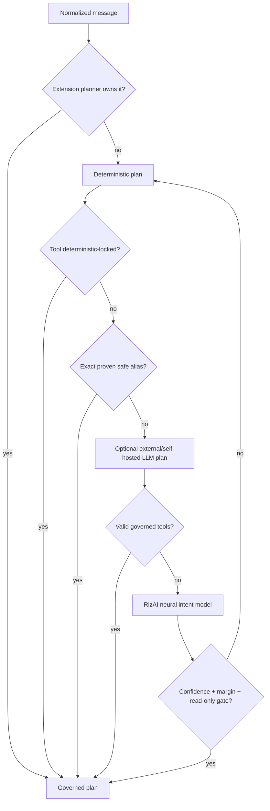
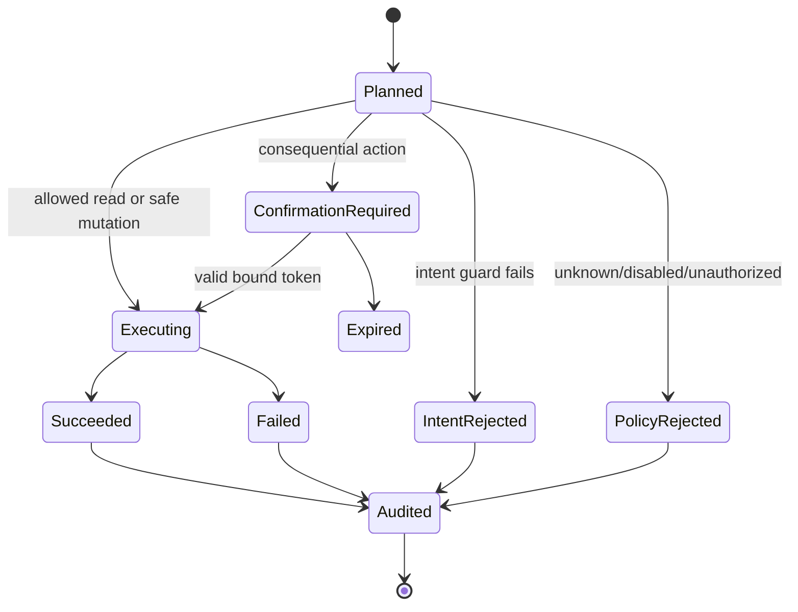
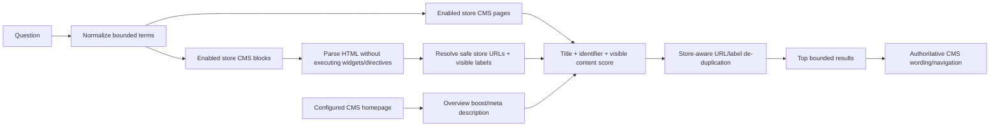
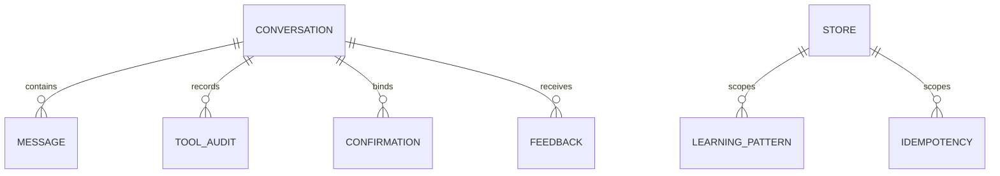

# Low-level design

> Version 5.0.0 · Reviewed 2026-08-26

## Primary classes and responsibilities

| Component | Responsibility |
|---|---|
| `AgentService` | Turn orchestration, conversation/context, execution, merge and persistence |
| `CompositePlanner` | Extension rules → deterministic locks → adaptive memory → optional LLM → local neural fallback → deterministic fallback |
| `DeterministicPlanner` | Bounded English commerce intent grammar, argument extraction and safety fallback |
| `NeuralModelRuntime` | Loads bundled learned weights and executes pure-PHP MLP inference |
| `FeatureHasher` | Reproduces the training feature space in Magento runtime |
| `NeuralIntentPlanner` | Confidence-gated read-only tool planning from neural intent predictions |
| `ProviderManager` | Store-scoped external/self-hosted generative provider chain and resilience |
| `ToolRegistry` | Named governed capability definitions and execution |
| `ToolPolicy` | Metadata-driven visibility and execution authorization |
| `CoreToolIntentGuard` | Stops a model from calling a tool unrelated to explicit wording |
| `KnowledgeService` | Store-scoped CMS page/block discovery, homepage grounding, public fact extraction |
| `StoreInformationService` | Store profile/config plus safe CMS content fallback |
| `ExternalFactPolicy` | Allow-list/redact facts sent for external synthesis |
| `ResponseSynthesisService` | Optional wording; preserves authoritative/mutation messages |
| `SuggestionService` | DI suggestions, deduplication and informational-response suppression |

## Planning decision flow



Identity, CMS knowledge, store profile and consequential operations are deterministically locked where appropriate so neither an external LLM nor the local neural model can bypass authoritative retrieval. Neural fallback is deliberately read-only in 5.0.

## Tool execution state machine



## Response envelope

The response is a stable superset used by controllers, REST and GraphQL. Important members include:

```text
trace_id, conversation_id, client_id, message
products, filters, facets, page_info
cart, wishlist, checkout, orders
knowledge, store_profile, store_context
product_content, product_answer, comparison
inventory, price_insight, product_options
actions, suggestions, extensions, viewer
```

Absent domains are empty/null. A response must not reuse products from an earlier turn unless the current tool explicitly returns them.

## CMS ranking and extraction



Address extraction first uses Magento Store Information. If empty, it scans active store-scoped CMS content for a postal-address pattern. The value is not ShopCPR-hard-coded.

`KnowledgeService` caches its sanitized document index in Magento shared cache and in memory for
the current request. The shared entry is tagged with CMS page/block, configuration and store tags,
so normal Magento saves invalidate it. Dynamic widgets and arbitrary block directives are not
rendered while classifying a shopper message.

## Persistence



Exact table/column definitions remain authoritative in `etc/db_schema.xml`.

## Error behavior

- Shopper-correctable errors use bounded `LocalizedException` messages.
- Provider failures are logged without keys/prompts and fall through the configured provider chain/RizAI.
- Unknown tools and identities fail closed.
- Tool exceptions never become fabricated success messages.
- Optional extension/profile providers cannot break the core response.
