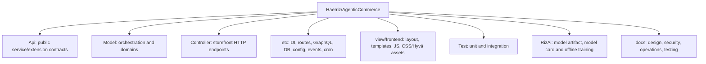
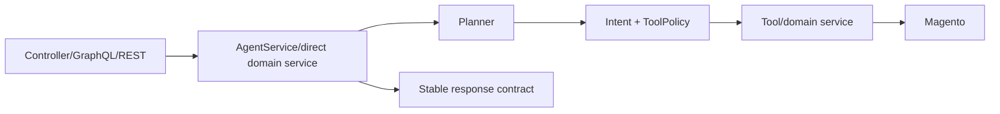

# Module file map

> Version 5.0.0 · Reviewed 2026-08-26

## Top-level map

## Model directories

| Directory | Purpose |
|---|---|
| `Model/Agent` | Tool policy, capabilities and extension capability registry |
| `Model/Ai` | Providers, prompts, redaction/fact policy and synthesis |
| `Model/Planner` | Deterministic, composite, neural-intent and bounded multi-step planning |
| `Model/RizAi` | Pure-PHP feature hashing and learned-weight neural inference runtime |
| `Model/Tool` | Governed shopper capability implementations |
| `Model/Intent` | Provider-independent intent validation |
| `Model/Knowledge` | CMS page/block ranking and public fact extraction |
| `Model/Store` | Store identity/context/profile information |
| `Model/Product`, `Search`, `Inventory`, `Recommendation` | Catalog intelligence |
| `Model/Cart`, `Checkout`, `Coupon` | Quote and checkout orchestration |
| `Model/Customer`, `Wishlist`, `Order` | Authenticated customer domains |
| `Model/Conversation` | Persistent conversation ownership/history |
| `Model/Confirmation`, `Action` | Consequential confirmation and idempotency |
| `Model/Learning` | Safe adaptive routing memory and feedback |
| `Model/Audit`, `Observability`, `Resilience` | Audit, telemetry, provider health/budgets |
| `Model/Resolver`, `GraphQl` | GraphQL adapters and identity/idempotency helpers |

## RizAI model files

| Path | Purpose |
|---|---|
| `RizAi/Model/rizai-commerce-intent-v1.json` | Versioned learned neural weights + model metadata |
| `RizAi/Model/rizai-commerce-intent-v1.sha256` | Release checksum verified before PHP inference |
| `RizAi/Model/MODEL_CARD.md` | Intended use, limitations and governance |
| `RizAi/Training/build_dataset.py` | Rebuilds the reviewed synthetic commerce-intent corpus |
| `RizAi/Training/commerce_intents.jsonl` | Versioned train/validation examples |
| `RizAi/Training/train.py` | Offline PyTorch training and PHP-compatible weight export |
| `RizAi/Training/validate_artifact.py` | Recomputes exported-weight metrics, shape/checksum and split-integrity checks |
| `RizAi/Training/requirements.txt` | Offline training dependencies only |
| `RizAi/Generative/` | LoRA/QLoRA generative commerce-model training, merge and evaluation toolkit; no generative weights bundled |

## Configuration files

| File | Purpose |
|---|---|
| `etc/module.xml` | Module declaration/sequence |
| `etc/config.xml` | Default store/global configuration |
| `etc/adminhtml/system.xml` | Magento Admin controls |
| `etc/di.xml` | Preferences, registries, tool metadata and extension points |
| `etc/webapi.xml` | REST service-contract routes |
| `etc/schema.graphqls` | Headless GraphQL schema |
| `etc/frontend/routes.xml` | Storefront controller route |
| `etc/frontend/di.xml` | Frontend-area wiring |
| `etc/frontend/events.xml` | Storefront observers |
| `etc/db_schema.xml` | Module persistence schema |
| `etc/cron_groups.xml`, `etc/crontab.xml` | Cleanup scheduling |
| `etc/csp_whitelist.xml` | Required content-security declarations |

## Runtime entry flow

Refer to [Low-level design](LOW_LEVEL_DESIGN.md) for class responsibilities.

- `docs/RIZAI_GENERATIVE_MODEL_ROADMAP.md` — governed path from the bundled neural classifier to a separately served generative RizAI transformer.
- `RIZAI_5.0_IMPLEMENTATION_SUMMARY.md` — release/presentation handoff for the 5.0 neural upgrade.
