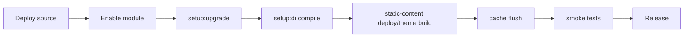
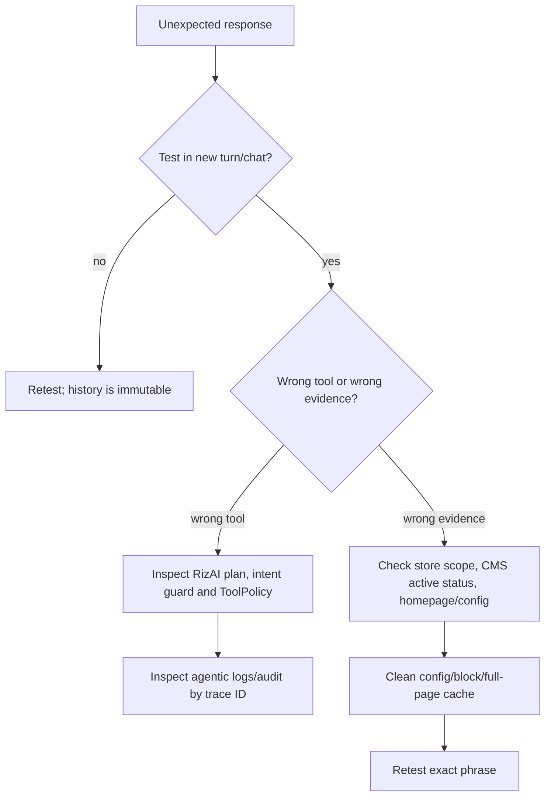
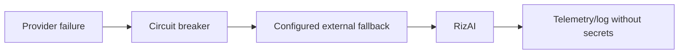

# Operations runbook

> Version 5.0.0 · Reviewed 2026-08-26

## Deployment flow



```bash
bin/magento module:enable Haerriz_AgenticCommerce
bin/magento setup:upgrade --keep-generated
bin/magento setup:di:compile
bin/magento setup:static-content:deploy -f
bin/magento cache:flush
```

Run the project’s normal Hyvä Tailwind build when applicable.

## Required smoke tests

1. Homepage/storefront returns HTTP 200.
2. New chat starts and persists across reload.
3. `what's the address?` returns current-store configured/CMS content.
4. `what's blended learning?` returns CMS evidence and no product dump.
5. `2+2` is declined with zero products/suggestions.
6. Product search, refine, product detail, stock and price work.
7. Guest cart and signed-in cart work with exact options.
8. OpenAI failure falls back to RizAI.
9. Capabilities/store-profile endpoints are reachable.
10. Cron, provider telemetry and sanitized audit are healthy.

## Troubleshooting decision tree



## Provider incident



Do not disable ToolPolicy or endpoint protections to restore service. RizAI is the safe availability path.

## CMS knowledge incident

- Confirm page/block is active.
- Confirm current-store or All Store Views assignment.
- Confirm configured homepage identifier/meta description for overview questions.
- Check duplicate/conflicting global content.
- Confirm the visible anchor/heading label matches the shopper wording; hidden text is excluded.
- CMS page/block and store saves normally invalidate the tagged knowledge index automatically.
- Clean Magento block/config/full-page caches.
- Use a new assistant turn; old persisted responses do not change.
