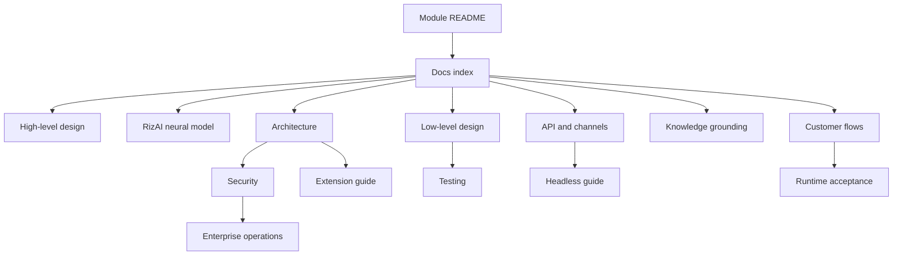
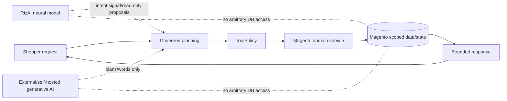

# Agentic Commerce documentation

Version: **5.0.0**  
API: **2026-08-v5.0**  
Last reviewed: **2026-08-26**

This directory is the design and operating handbook for `Haerriz_AgenticCommerce`. RizAI 5.0 is the built-in, API-key-free hybrid neuro-symbolic Commerce Brain with a bundled trained neural intent model. OpenAI, Gemini, a separately trained RizAI self-hosted LLM and compatible providers are optional planners/response synthesizers; Magento remains authoritative.

## Start here

| Audience | Document |
|---|---|
| Product/engineering leadership | [High-level design](HIGH_LEVEL_DESIGN.md) |
| Anyone evaluating the built-in AI | [What RizAI is—and is not](RIZAI.md) and [Neural model design](RIZAI_NEURAL_MODEL.md) |
| Solution architects | [Architecture](ARCHITECTURE.md) |
| Developers/reviewers | [Low-level design](LOW_LEVEL_DESIGN.md) |
| New module maintainers | [Module file map](MODULE_FILE_MAP.md) and [Design decisions](DESIGN_DECISIONS.md) |
| UX/QA/business | [Customer flows](CUSTOMER_FLOWS.md) |
| CMS/content/security teams | [Knowledge grounding](KNOWLEDGE_GROUNDING.md) |
| PWA/Hyvä/mobile teams | [API and channels](API_AND_CHANNELS.md) and [Headless](HEADLESS.md) |
| Operations/SRE | [Enterprise operations](ENTERPRISE_OPERATIONS.md) and [Runtime acceptance](RUNTIME_ACCEPTANCE.md) |
| Security reviewers | [Security](SECURITY.md) |
| Extension developers | [Enterprise extension guide](ENTERPRISE_EXTENSION_GUIDE.md) |
| QA/developers | [Testing](TESTING.md) and [Phrase coverage](PHRASE_COVERAGE.md) |

## Documentation map

## Non-negotiable principle

The module makes Magento data agent-usable. It does not give a model database, unrestricted GraphQL, payment-secret or customer-identity authority.
