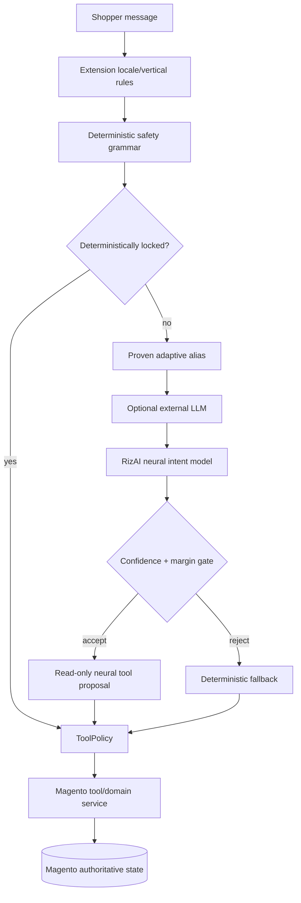
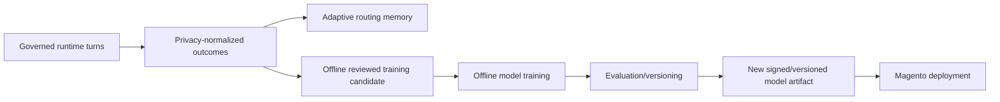

# RizAI: hybrid neuro-symbolic Commerce Brain

> Version 5.0.0 · Reviewed 2026-08-26

## Short answer

**RizAI 5.0 now contains a real independently trained neural-network model.**

It is not a foundation model or a generative LLM. The built-in model is a compact feed-forward neural network trained to classify commerce intents, combined with the existing deterministic Magento-native planner, ToolPolicy, server-owned context and authoritative commerce tools.

The most accurate technical description is:

> **RizAI is a hybrid neuro-symbolic Agentic Commerce model: a learned neural intent model plus deterministic planning/governance and Magento-grounded tool execution.**

The stable internal provider/configuration code remains `deterministic` for backward compatibility even though the local Commerce Brain now contains both deterministic and neural components.

## What is genuinely learned

The module ships a learned-weight artifact:

`RizAi/Model/rizai-commerce-intent-v1.json`

The current network has:

| Property | Value |
|---|---|
| Model family | RizAI Commerce Neural Intent |
| Model type | Feed-forward neural network / MLP |
| Input | Hashed word unigrams, word bigrams, character 3-grams and 4-grams |
| Input dimension | 1,024 |
| Hidden layer | 96 ReLU neurons |
| Output | 19-way softmax commerce-intent classification |
| Runtime | Pure PHP inference inside Magento |
| Training runtime | Offline Python + PyTorch |
| External API required for inference | No |
| Online weight updates | No |

The bundled training corpus contains 2,904 training examples and 720 grouped holdout examples (3,624 total) generated from reviewed commerce-intent templates. The exported model reaches 90.56% grouped-holdout accuracy with mean confidence 91.81%. This is still a controlled synthetic/curated benchmark and **is not a production or multilingual SLA**.

## How the 5.0 brain works

### Why this is neuro-symbolic

The **neural** part learns statistical mappings from language patterns to commerce intents.

The **symbolic** part contains explicit safety/business logic:

- tool registry;
- ToolPolicy and authorization hooks;
- deterministic locks for sensitive/consequential intents;
- confirmation boundaries;
- structured argument extraction;
- Magento service-contract execution;
- hard privacy/security invariants.

That combination is intentional. Commerce has areas where probabilistic interpretation is useful and other areas—price, tax, stock, ownership, payments and order placement—where deterministic authority is mandatory.

## Runtime inference

`Model/RizAi/FeatureHasher.php` converts a message into the same fixed feature space used during training. `Model/RizAi/NeuralModelRuntime.php` loads the versioned weight file and performs matrix multiplication, ReLU and softmax in PHP.

A neural route is considered only when:

1. the feature is enabled in store configuration;
2. the model artifact loads successfully;
3. top-1 confidence exceeds the configured threshold;
4. the top-1/top-2 probability margin exceeds the configured threshold;
5. the proposed route is read-only and planner-visible;
6. the deterministic safety kernel has not already locked the request to an authoritative route.

The default confidence threshold is `0.90` and default top-2 margin is `0.18`.

## What the neural model can currently help classify

The bundled model recognizes intent families including:

- catalog/product search;
- category search and catalog navigation;
- store contact/information;
- return/shipping/privacy/warranty policy questions;
- CMS page navigation;
- cart/wishlist/order/checkout/profile/newsletter reads;
- product description/details;
- product comparison;
- stock/inventory;
- price;
- related recommendations;
- small talk;
- deliberately out-of-scope requests.

Only bounded read-only tool plans are produced by the neural fallback in 5.0. Mutations are still deterministic/externally planned and then guarded by ToolPolicy.

## Neural training is different from adaptive routing memory

Adaptive learning still stores privacy-normalized successful phrase→tool observations. It does not change the neural weights live.

This split prevents a shopper from poisoning live model weights or teaching the system new permissions. A future MLOps pipeline can automate parts of review/evaluation, but deployment must remain governed.

## RizAI versus an LLM/foundation model

| Characteristic | RizAI 5.0 built-in model | Generative LLM/foundation model |
|---|---|---|
| Learned neural weights | Yes | Yes |
| Independently trained model artifact | Yes | Yes |
| Generative language model | No | Yes |
| Billions of parameters | No | Often |
| Broad general knowledge | Deliberately no | Usually |
| Commerce-intent specialization | Yes | Depends on fine-tuning/prompting |
| Runs inside Magento PHP | Yes | Usually no |
| Requires GPU/model server | No | Usually for self-hosted inference |
| Can authorize Magento actions | No | No |
| Magento remains source of truth | Yes | Must remain yes |

## Path to a true RizAI generative LLM

5.0 also adds `rizai_local_llm`, a provider slot for a separately trained/fine-tuned RizAI generative model served through an OpenAI-compatible endpoint.

A real generative RizAI release would require all of the following before it should be called an LLM:

1. choose a legally usable open-weight base transformer;
2. build a reviewed commerce/tool-calling instruction corpus;
3. train/fine-tune weights, usually with LoRA/QLoRA or full fine-tuning;
4. evaluate tool-call accuracy, hallucination, privacy leakage, prompt injection and multilingual behavior;
5. version the resulting weights/adapters and model card;
6. serve the model through hardened GPU inference infrastructure;
7. configure `rizai_local_llm` in Magento;
8. keep ToolPolicy/Magento as the final authority.

Until those generative weights exist and are evaluated, the correct 5.0 claim is **neural model / hybrid neuro-symbolic model**, not “proprietary LLM” or “foundation model”.

## Naming guidance

Recommended product wording:

> RizAI is the Magento-native hybrid neuro-symbolic Commerce Brain for Agentic Commerce. It includes a locally executed trained neural intent model and a deterministic safety/governance kernel. Optional external or self-hosted generative LLMs can extend language reasoning while Magento remains authoritative.

Avoid saying “RizAI is a foundation model” or “RizAI is our LLM” unless a separately trained generative transformer model is actually built, evaluated and deployed.
